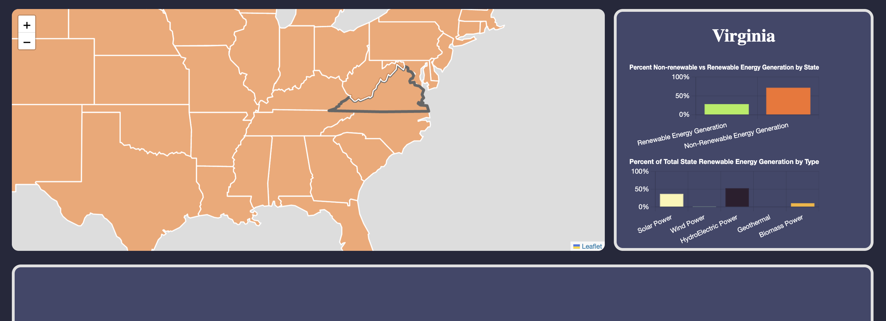
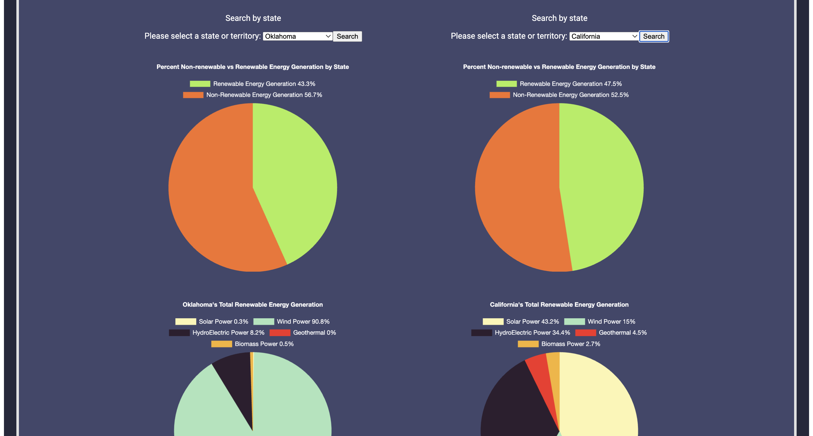

# GigawhatMap
A tool for viewing and comparing data on Renewable and Non-Renewable energy usage across the United States.

## Usage

Simply hover over a state on the map section of the page and the statistics of that state's energy usage will be displayed to the right. The stats show the amount of renewal vs non-renewal energy and the percentage amount of each different methods of renewable energy generation used that make up the total.

There is also the comparison section, simply select a state with the dropdown menu, then select another with the other dropdown menu, and you can compare the energy usage of both states.

  
  

